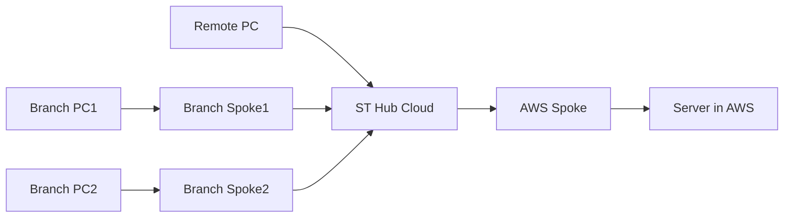
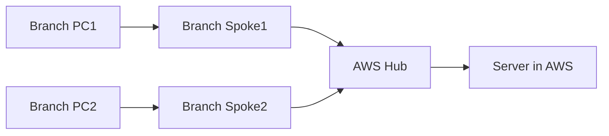

### ST Hub + BWAN Clients

```mermaid
flowchart LR
    RemotePC[Remote PC]
    STHub[ST Hub Cloud]
    AWSspoke[AWS Spoke]
    Server[Server in AWS]
    BranchPC1[Branch PC1]
    BranchPC2[Branch PC2]
    BranchSpoke1[Branch Spoke1]
    BranchSpoke2[Branch Spoke2]

    RemotePC --> STHub
    STHub --> AWSspoke
    AWSspoke --> Server
    BranchPC1 --> BranchSpoke1
    BranchPC2 --> BranchSpoke2
    BranchSpoke1 --> STHub
    BranchSpoke2 --> STHub
```
### Hub in AWS + Spoke only

```mermaid
flowchart LR
    AWSHub[AWS Hub]
    Server[Server in AWS]
    BranchPC1[Branch PC1]
    BranchPC2[Branch PC2]
    BranchSpoke1[Branch Spoke1]
    BranchSpoke2[Branch Spoke2]

    AWSHub --> Server
    BranchPC1 --> BranchSpoke1
    BranchPC2 --> BranchSpoke2
    BranchSpoke1 --> AWSHub
    BranchSpoke2 --> AWSHub
```
