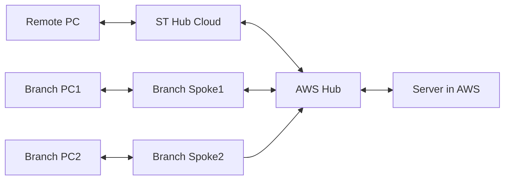
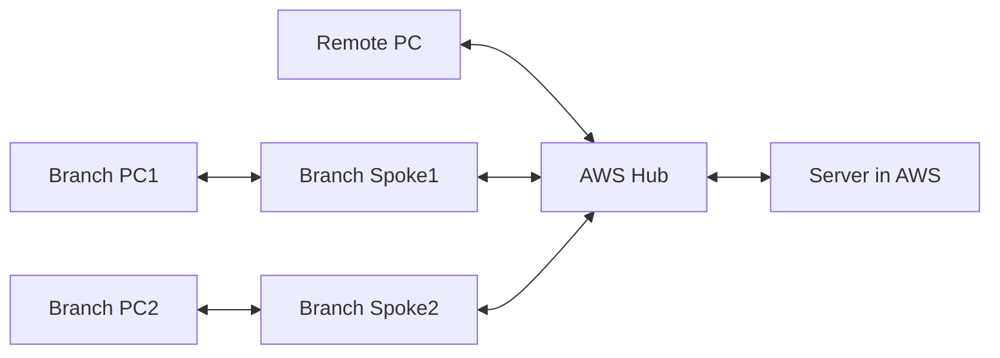

### ST Hub + Hub in AWS + Spoke + BWAN Clients
Good: No attack surface and remote user can connect to SD WAN.  
Bad: High cost

### Hub in AWS + Spoke + BWAN Client
Good: low cost and remote users can connec to SD WAN.  
Bad: Attack surface

### Hub in AWS + Spoke only
Good: no attack surface and low cost.  
Bad: remote user cannot connect to SDWAN Tunnel

